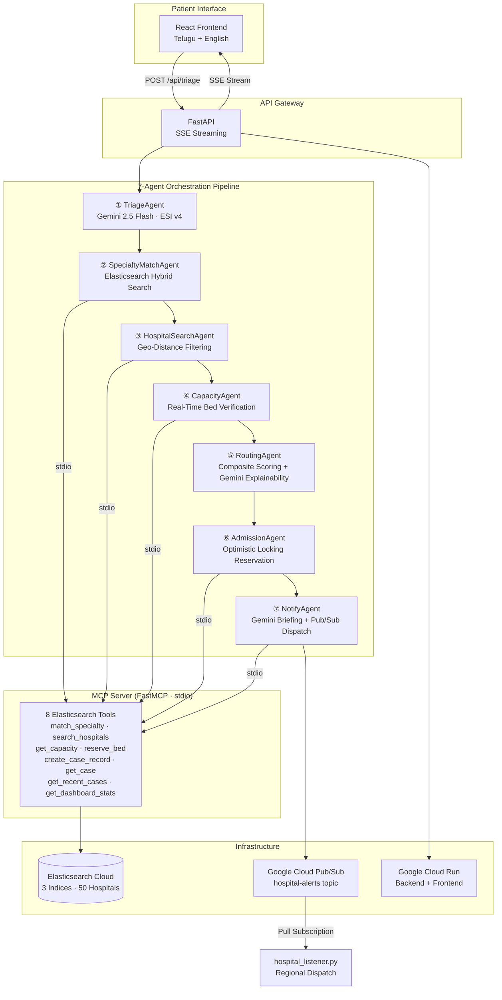
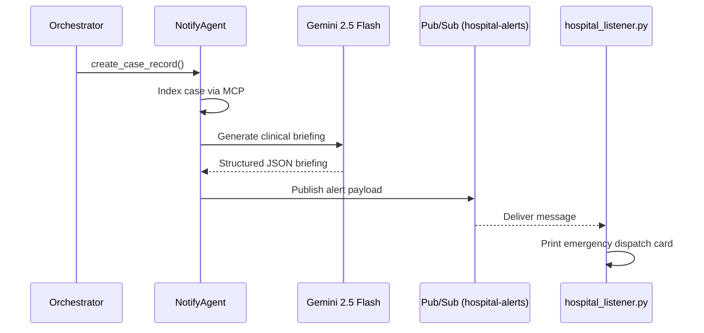

<p align="center">
  
  
</p>
<p align="center">
  
  
  
  
  
  
  
  
</p>

<h1 align="center">🚑 CrisisRoute AI</h1>
<h3 align="center"><em>The Right Patient. The Right Hospital. The Right Time.</em></h3>

<p align="center">
CrisisRoute AI is a <strong>Gemini-powered, multi-agent emergency healthcare routing platform</strong> built for Andhra Pradesh. It triages patient symptoms using AI, identifies the required medical specialty, discovers nearby hospitals through Elasticsearch, verifies real-time bed and ICU capacity, ranks candidates using an explainable composite scoring algorithm, atomically reserves a bed, and dispatches a clinical pre-alert to the receiving hospital — all within a single, streaming pipeline that completes in seconds. No human in the loop. No wasted golden hour.
</p>

---

## 🏗️ Architecture



---

## 🔥 The Problem

### Emergency Routing in Rural India Is Broken

In Andhra Pradesh — and across rural India — **emergency patients are routed to the nearest hospital, not the most appropriate one.**

A cardiac arrest patient may be taken to a Community Health Centre with no cardiology unit. A stroke victim may arrive at a hospital with zero ICU beds. A trauma patient may reach a facility that lacks surgical capability.

The result:

| Failure Mode | Consequence |
| :--- | :--- |
| **Nearest ≠ Best** | Patients arrive at hospitals that cannot treat them |
| **No capacity awareness** | Ambulances discover full beds on arrival |
| **No specialty matching** | Critical patients sent to general facilities |
| **No pre-notification** | Hospitals unprepared for incoming emergencies |
| **Golden hour wasted** | Secondary transfers consume the survival window |

> **The golden hour is the 60-minute window after a critical emergency where intervention most impacts survival. Every minute of misrouting reduces the probability of a good outcome.**

CrisisRoute eliminates routing uncertainty by making every decision data-driven, AI-assessed, and clinically explainable — before the ambulance moves.

---

## ⚙️ How CrisisRoute Works

### The 7-Agent Pipeline

Each triage request flows through 7 autonomous agents, orchestrated as a real-time SSE stream. The frontend renders each step as it completes.

#### ① TriageAgent — AI Severity Classification

**Engine:** Gemini 2.5 Flash with structured JSON output via Pydantic schema (`TriageResult`)

Classifies patient symptoms into three ESI v4 severity levels:
- **Critical** → Immediate life threat (MI, stroke, major trauma, anaphylaxis)
- **Urgent** → Serious, high-risk, seen within 15–30 min (fractures, moderate asthma)
- **Stable** → Low urgency, can wait (minor cuts, mild fever)

Outputs: `severity`, `chief_complaint`, `keywords`, `reasoning`, `immediate_action`, `confidence`, `differential_diagnoses`, `red_flags`

Safety: On any API failure, defaults to **critical** — always over-triages, never under-triages.

#### ② SpecialtyMatchAgent — Elasticsearch Semantic Mapping

**Engine:** Elasticsearch full-text search on `symptom_specialty_map` index with fuzziness + red-flag boosting

Maps extracted symptom keywords to the required medical specialty (cardiology, neurology, trauma, pediatrics, etc.). For critical-severity patients, applies red-flag override logic that boosts life-threatening specialties when keyword signals are present.

Falls back to keyword-based matching when Elasticsearch is unavailable.

#### ③ HospitalSearchAgent — Geo-Distance Discovery

**Engine:** Elasticsearch `geo_distance` filter on `hospitals` index

Searches for hospitals within a configurable radius of the patient's coordinates. Implements a 4-tier fallback cascade:
1. Specialty + radius + capacity required
2. Specialty + 2× radius + capacity required
3. Any specialty + radius + capacity required
4. Any specialty + radius + no capacity filter

Ensures candidates are always returned, even in sparse rural regions.

#### ④ CapacityAgent — Real-Time Bed Verification

**Engine:** Elasticsearch `mget` batch retrieval via MCP

Fetches current `beds_available`, `icu_available`, and `ventilators_available` for every candidate hospital in a single batch request. Returns safe defaults (`beds_available: 0`, `capacity_status: full`) for unresolvable IDs.

#### ⑤ RoutingAgent — Composite Scoring + AI Explainability

**Engine:** Deterministic weighted scoring algorithm + Gemini 2.5 Flash explainability layer

Scores each candidate hospital across 5 dimensions, with severity-adjusted weights:

| Factor | Critical | Urgent | Stable |
| :--- | :---: | :---: | :---: |
| **ETA** | 0.40 | 0.15 | 0.10 |
| **Distance** | 0.05 | 0.25 | 0.40 |
| **Capacity** | 0.15 | 0.25 | 0.30 |
| **ICU** | 0.25 | 0.10 | 0.05 |
| **Specialty** | 0.15 | 0.25 | 0.15 |

ICU scoring uses logarithmic normalization: `log1p(icu_available) / log1p(50)` — diminishing returns past ~15 beds, preventing oversaturation by mega-hospitals.

ETA is computed via the Google Maps Distance Matrix API with haversine fallback when the API key is absent.

After deterministic ranking, Gemini 2.5 Flash generates a **clinical routing justification**: why Hospital #1 was selected, why alternatives were rejected, risk factors considered, and a confidence score.

#### ⑥ AdmissionAgent — Atomic Bed Reservation

**Engine:** Elasticsearch optimistic concurrency control (`if_seq_no` + `if_primary_term`) via MCP

Atomically decrements `beds_available` on the selected hospital. Retries up to 3 times on version conflicts. Prevents double-booking across concurrent requests.

#### ⑦ NotifyAgent — AI Briefing + Pub/Sub Dispatch

**Engine:** Gemini 2.5 Flash structured briefing + Google Cloud Pub/Sub

Generates a hospital-ready clinical briefing using Gemini:
- **Emergency Summary** — Patient presentation and chief complaints
- **Recommended Preparation** — ER bay setup instructions
- **Required Team** — Specialists and staff on standby
- **Risk Assessment** — Transit and arrival risk evaluation

Indexes the complete case record in Elasticsearch via MCP (`triage_cases` index), then publishes the structured briefing to the GCP Pub/Sub topic `hospital-alerts` with 3-attempt exponential backoff retry logic.

---

## 🤖 Gemini 2.5 Flash Integration

Gemini is used in **three distinct agents** — never for routing decisions, always for clinical intelligence:

| Agent | Purpose | Schema |
| :--- | :--- | :--- |
| **TriageAgent** | ESI v4 severity classification | `TriageResult` (Pydantic) |
| **RoutingAgent** | Post-ranking clinical justification | `RoutingExplanation` (Pydantic) |
| **NotifyAgent** | Hospital-ready dispatch briefing | `HospitalBriefing` (Pydantic) |

All three use `response_mime_type="application/json"` with `response_schema` to enforce structured output parsing. Every call implements 3-attempt retry with exponential backoff and deterministic fallback responses on failure.

---

## 🔌 MCP Server Integration

CrisisRoute implements the **Model Context Protocol** using `FastMCP` for the server and the official `mcp` Python SDK for the client.

### Server: `mcp_server.py`

A standalone FastMCP process exposing 8 tools over stdio:

| Tool | Description |
| :--- | :--- |
| `match_specialty` | Symptom-to-specialty mapping with red-flag boosting |
| `search_hospitals` | Geo-distance hospital discovery with 4-tier fallback |
| `get_capacity` | Batch capacity check via `mget` |
| `reserve_bed` | Atomic bed reservation with optimistic locking |
| `create_case_record` | Case indexing in `triage_cases` |
| `get_case` | Single case retrieval by ID |
| `get_recent_cases` | Recent cases sorted by timestamp |
| `get_dashboard_stats` | Aggregated system-wide capacity statistics |

### Client: `agents/mcp_client.py`

A thread-safe singleton (`MCPClientManager`) that:
1. Spawns `mcp_server.py` as a subprocess
2. Maintains a persistent stdio session using a background `asyncio` event loop
3. Bridges synchronous agent calls to the async MCP SDK
4. Reconnects automatically on session failure

Three agents are fully decoupled from the Elasticsearch SDK and communicate exclusively through MCP: `SpecialtyMatchAgent`, `CapacityAgent`, and `NotifyAgent`.

---

## 🔍 Elasticsearch Architecture

### Indices

| Index | Purpose | Key Fields |
| :--- | :--- | :--- |
| `hospitals` | 50 AP hospitals with geo-points | `location` (geo_point), `specialties`, `beds_available`, `icu_available`, `hospital_tier` |
| `symptom_specialty_map` | 50 symptom-specialty mappings | `symptom_text`, `specialty`, `symptom_embedding` (768-dim dense vector) |
| `triage_cases` | Case history log | `case_id`, `triage_severity`, `hospital_selected_id`, `pipeline_duration_ms` |

### Query Patterns

- **Hospital Search**: `bool` query with `geo_distance` filter + `term` filter on specialties, sorted by `beds_available` DESC and `_geo_distance` ASC
- **Specialty Match**: `multi_match` with `fuzziness: AUTO` on `symptom_text`
- **Capacity Check**: `mget` for batch document retrieval
- **Bed Reservation**: `update` with Painless script + `if_seq_no`/`if_primary_term` for OCC
- **Dashboard**: `sum`, `terms` aggregations across districts

---

## 📡 Pub/Sub Notification Architecture



**Payload structure:**
```json
{
  "case_id": "CR-20260604-A1B2C3",
  "hospital_id": "AP-KRS-001",
  "severity": "critical",
  "specialty": "cardiology",
  "eta_minutes": 12,
  "timestamp": "2026-06-04T18:00:00Z",
  "briefing": {
    "Emergency Summary": "...",
    "Recommended Preparation": "...",
    "Required Team": "...",
    "Risk Assessment": "..."
  }
}
```

The `hospital_listener.py` subscriber auto-detects the `PUBSUB_EMULATOR_HOST` environment variable for local development and creates topics/subscriptions automatically in emulator mode.

---

## 🏥 Hospital Tier Model

Hospital capabilities are modeled in three tiers to reflect real-world clinical capacity in Andhra Pradesh:

| Tier | Examples | Beds | ICU | Specialties | Capabilities |
| :--- | :--- | :---: | :---: | :---: | :--- |
| **Tier 1** | Apollo, KIMS, GGH, Narayana, Manipal | 200–600 | 15–60 | 6–10+ | Cardiology, Neurology, Oncology, Trauma, full surgical |
| **Tier 2** | Area Hospitals, District Hospitals, mid-size private | 100–300 | 5–20 | 4–6 | General, Trauma, selectively Cardiology/Neurology |
| **Tier 3** | Community Health Centres | 20–80 | 0–5 | 2–3 | General, Trauma only. No cardiology, neurology, or oncology |

Tier classification is enforced during hospital seeding. Tier 3 hospitals are explicitly excluded from receiving cardiology, neurology, and oncology specialties — preventing the system from ever routing a cardiac arrest to a Community Health Centre.

---

## 📊 Routing Score Calculation

The composite score for each hospital is computed as:

```
score = (eta_score × W_eta) + (dist_score × W_dist) + (capacity_score × W_cap) + (icu_score × W_icu) + (specialty_score × W_spec)
```

| Component | Formula | Range |
| :--- | :--- | :---: |
| **ETA Score** | `1.0 − (eta − min_eta) / (max_eta − min_eta)` | 0–1 |
| **Distance Score** | `1.0 − (dist / max_dist)` | 0–1 |
| **Capacity Score** | `1.0` if beds > 20, `0.7` if > 10, `0.4` if > 0, `0.0` if full | 0–1 |
| **ICU Score** | `log1p(icu_available) / log1p(50)` | 0–1 |
| **Specialty Score** | `1.0` if matched, `0.3` if not | 0.3–1 |

Hospitals at full capacity receive a **−0.20 penalty**. Critical-severity patients bypass the capacity filter entirely — ensuring even full hospitals are surfaced as last-resort options.

---

## 📈 Dashboard Analytics

The admin dashboard (`/#/dashboard`) provides real-time system-wide visibility:

- **Total hospitals**, **total beds**, **available beds**, **available ICU beds**
- **Occupancy rate** across the network
- **Status breakdown**: Available / Limited / Full
- **Per-district capacity** visualization
- **Recent triage cases** with severity, specialty, hospital, and pipeline duration

Data is sourced from Elasticsearch aggregations via the `get_dashboard_stats` MCP tool.

---

## 🌏 Andhra Pradesh Deployment

CrisisRoute covers **6 major cities** across Andhra Pradesh with **50 hospitals**:

| City | District | Hospitals |
| :--- | :--- | :---: |
| Vijayawada | Krishna | 12 |
| Visakhapatnam | Visakhapatnam | 10 |
| Guntur | Guntur | 8 |
| Tirupati | Chittoor | 8 |
| Kurnool | Kurnool | 6 |
| Nellore | Nellore | 6 |

Each hospital is seeded with realistic coordinates (jittered from city center), phone numbers, bed counts, ICU capacities, and specialty lists that are constrained by the tier model.

---

## 🗣️ Telugu Accessibility

The entire patient-facing interface supports **bilingual Telugu + English** with a one-tap toggle:

- All UI labels, buttons, and status messages are translated
- Symptom preset cards display both scripts: `🫀 Chest Pain / గుండె నొప్పి`
- Error messages are language-aware
- The emergency disclaimer renders in the active language

This is critical for Andhra Pradesh, where a significant portion of the population is more comfortable interacting in Telugu.

---

## 🌍 Real-World Impact

| Challenge | CrisisRoute Response |
| :--- | :--- |
| **Rural healthcare deserts** | 4-tier radius expansion ensures hospitals are always found, even in sparse regions |
| **Golden hour loss** | Critical-severity routing weights ETA at 40% — prioritizing speed over distance |
| **Hospital capability blindness** | Tier model prevents routing to facilities that lack required specialties |
| **Routing uncertainty** | Composite scoring with full breakdown removes guesswork from dispatch decisions |
| **Unprepared receiving teams** | Gemini-generated clinical briefings prepare ER bays before patient arrival |

---

## 🛡️ Clinical Safety Principles

> **CrisisRoute is a navigation aid — not a clinical diagnosis system.**

1. **Over-triage preference**: On AI failure, patients default to `critical`. Under-triage is never acceptable.
2. **Explainable recommendations**: Every routing decision includes a full score breakdown and AI-generated clinical justification.
3. **Human decision support**: The system recommends — it does not override ambulance crews, dispatchers, or physicians.
4. **Emergency disclaimer**: Every response includes: *"Always call 108 for life-threatening emergencies."*

---

## 🧰 Technology Stack

| Layer | Technology | Purpose |
| :--- | :--- | :--- |
| **Frontend** | React + Vite | Mobile-first bilingual patient UI |
| **Backend** | FastAPI + Uvicorn | SSE streaming API gateway |
| **AI Engine** | Gemini 2.5 Flash | Triage, routing explainability, dispatch briefings |
| **Search & Data** | Elasticsearch 8.15 | Hospital discovery, specialty matching, case storage |
| **MCP Framework** | FastMCP (server) + MCP SDK (client) | Tool-based Elasticsearch integration |
| **Messaging** | Google Cloud Pub/Sub | Real-time hospital pre-alerts |
| **Compute** | Google Cloud Run | Serverless container deployment |
| **Concurrency** | Painless scripting + OCC | Atomic bed reservation |
| **Schema Validation** | Pydantic v2 | Structured Gemini output enforcement |

---

## 📁 Repository Structure

```
crisisroute/
├── api/
│   └── main.py                    # FastAPI app, SSE streaming, rate limiting
├── agents/
│   ├── orchestrator.py            # 7-step pipeline coordinator
│   ├── triage_agent.py            # Gemini ESI v4 classification
│   ├── specialty_match_agent.py   # MCP → Elasticsearch specialty mapping
│   ├── capacity_agent.py          # MCP → batch capacity checks
│   ├── routing_agent.py           # Composite scoring + Gemini explainability
│   ├── notify_agent.py            # Gemini briefing + Pub/Sub dispatch
│   └── mcp_client.py             # Thread-safe MCP client singleton
├── data/
│   ├── hospitals_ap.py            # 50 AP hospital seed data with tiers
│   └── symptom_specialties.py     # 50 symptom-specialty mappings
├── scripts/
│   └── create_indices.py          # Elasticsearch index creation
├── frontend/
│   ├── src/
│   │   ├── App.jsx                # Main triage UI (Telugu + English)
│   │   ├── Dashboard.jsx          # Admin analytics dashboard
│   │   ├── App.css                # Styling
│   │   └── main.jsx               # Vite entry point
│   ├── Dockerfile                 # Frontend container
│   └── deploy.sh                  # Cloud Run frontend deployment
├── docs/
│   ├── mcp_architecture.md        # MCP server documentation
│   ├── pubsub_architecture.md     # Pub/Sub alerting documentation
│   └── routing_validation.md      # Routing algorithm validation
├── tests/
│   └── test_agents.py             # 16 unit tests
├── mcp_server.py                  # FastMCP server (8 tools)
├── mcp_config.json                # MCP client configuration
├── hospital_listener.py           # Pub/Sub subscriber example
├── Dockerfile                     # Backend container
├── deploy.sh                      # Cloud Run backend deployment
├── requirements.txt               # Python dependencies
└── README.md
```

---

## 🚀 Getting Started

### Prerequisites

- Python 3.11+
- Node.js 18+
- An Elasticsearch Cloud deployment (or local instance)
- A Google Cloud project with Gemini API access

### 1. Clone

```bash
git clone https://github.com/your-org/crisisroute.git
cd crisisroute
```

### 2. Install Backend Dependencies

```bash
python -m venv venv
source venv/bin/activate
pip install -r requirements.txt
```

### 3. Configure Environment Variables

Create a `.env` file in the project root:

```env
# Elasticsearch
ELASTIC_ENDPOINT=https://your-cluster.es.cloud.es.io
ELASTIC_API_KEY=your_elastic_api_key

# Gemini
GEMINI_API_KEY=your_gemini_api_key

# Google Cloud
GOOGLE_CLOUD_PROJECT=your-project-id

# Optional
GOOGLE_MAPS_API_KEY=your_maps_api_key
DEBUG_ROUTING=false
```

### 4. Create Elasticsearch Indices

```bash
python scripts/create_indices.py
```

### 5. Seed Hospital Data

```bash
python data/hospitals_ap.py
python data/symptom_specialties.py
```

### 6. Run the Backend

```bash
uvicorn api.main:app --port 8080 --reload
```

### 7. Run the Frontend

```bash
cd frontend
npm install
npm run dev
```

### 8. Run the MCP Server (standalone, for testing)

```bash
python mcp_server.py
```

### 9. Run the Pub/Sub Listener (local emulator)

```bash
# Terminal 1: Start emulator
gcloud beta emulators pubsub start --host-port=127.0.0.1:8085

# Terminal 2: Start listener
export PUBSUB_EMULATOR_HOST=127.0.0.1:8085
python hospital_listener.py
```

---

## ☁️ Deployment

CrisisRoute is deployed on **Google Cloud Run** (asia-south1).

### Backend

```bash
chmod +x deploy.sh
./deploy.sh
```

This builds the container from `Dockerfile`, deploys to Cloud Run with 1 GiB memory, 2 workers, and injects environment variables from `.env`.

### Frontend

```bash
cd frontend
chmod +x deploy.sh
./deploy.sh
```

### Pub/Sub Topic Setup

```bash
gcloud pubsub topics create hospital-alerts

gcloud pubsub topics add-iam-policy-binding hospital-alerts \
  --member="serviceAccount:YOUR_SA@YOUR_PROJECT.iam.gserviceaccount.com" \
  --role="roles/pubsub.publisher"
```

---

## 🧪 Testing

```bash
# Run all 16 tests
PYTHONPATH=. pytest tests/ -v

# Run a specific test
PYTHONPATH=. pytest tests/test_agents.py -k test_notify_agent_case_creation -v

# Run with debug output
PYTHONPATH=. pytest tests/ -v -s
```

### Test Coverage

| Test | Validates |
| :--- | :--- |
| `test_haversine_distance` | Haversine geo-distance calculation accuracy |
| `test_specialty_match_keyword_fallback` | Keyword-based specialty matching for cardiology, neurology, general |
| `test_capacity_check_nonexistent_ids` | Safe defaults for missing hospital IDs |
| `test_routing_ranking_algorithm` | Composite score ranking correctness |
| `test_notify_agent_case_creation` | Case creation, briefing generation, Pub/Sub dispatch |
| `test_triage_agent_error_graceful_fallback` | Fallback to critical on Gemini failure |
| `test_routing_ranking_algorithm_eta_influence` | ETA weight dominance in critical routing |
| `test_routing_cardiac_scenario` | Cardiology specialty match prioritization |
| `test_icu_scaling` | Logarithmic ICU score curve validation |
| `test_score_breakdown_exists` | Score breakdown field completeness |
| `test_cardiology_routing` | Cardiology vs. non-cardiology ranking |
| `test_score_bounds` | Score range bounds and NaN prevention |
| `test_cardiac_emergency_scenario` | Tier 1 hospital preference for cardiac emergencies |
| `test_trauma_emergency_scenario` | Trauma specialty matching |
| `test_neurology_emergency_scenario` | Neurology specialty matching |
| `test_routing_explanation` | Gemini explainability output structure |

---

## 🗺️ Future Roadmap

| Initiative | Description |
| :--- | :--- |
| **ABDM Integration** | Connect to India's Ayushman Bharat Digital Health Mission for verified facility data |
| **Ambulance Dispatch** | Real-time GPS integration with 108 ambulance fleet management |
| **Live Hospital Feeds** | Replace seed data with real-time HMIS/eSushrut bed availability feeds |
| **Predictive Occupancy** | ML-based forecasting of hospital capacity based on historical admission patterns |
| **Voice-First Interface** | Telugu and English voice input for hands-free triage during emergencies |

---

## 🏆 Hackathon Submission

CrisisRoute was built for the **Google Cloud Rapid Agent Hackathon 2026 — Elastic Track**.

| Requirement | Implementation |
| :--- | :--- |
| **Google Cloud** | Cloud Run (backend + frontend), Pub/Sub (hospital alerts), Vertex AI / Gemini API |
| **Gemini** | 2.5 Flash used in 3 agents: triage classification, routing explainability, dispatch briefings |
| **MCP Integration** | FastMCP server exposing 8 Elasticsearch tools over stdio, consumed by 3 refactored agents |
| **Elasticsearch** | 3 indices, geo-distance queries, full-text search, aggregations, optimistic locking, dense vectors |
| **Pub/Sub** | Production-grade hospital alerting with retry logic and local emulator support |
| **Multi-Agent** | 7-agent autonomous pipeline with SSE streaming and deterministic fallbacks |

---

## 📄 License

MIT License. See [LICENSE](LICENSE) for details.

---

<p align="center">
  <strong>Built for the golden hour. Built for Andhra Pradesh. Built to save lives.</strong>
</p>
