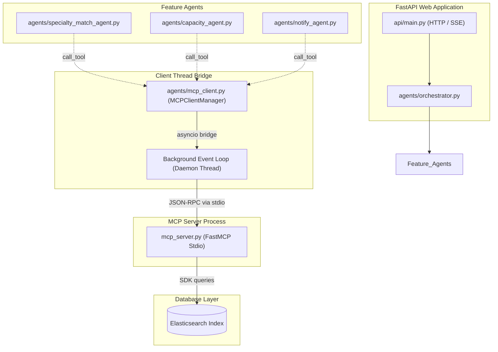

# Elastic MCP Integration Architecture

This document details the integration of the Model Context Protocol (MCP) in CrisisRoute AI. All direct Elasticsearch client connections inside the feature agents have been refactored to communicate through a persistent Model Context Protocol (MCP) server.

---

## 1. Architecture Overview

Rather than creating a new Elasticsearch client in every agent, CrisisRoute implements a centralized **Elasticsearch MCP Server** (`mcp_server.py`) and a persistent, asynchronous **MCP Client Manager** (`agents/mcp_client.py`).

### High-Level Component Relationship



---

## 2. Sequence Diagram: Triage & Routing Pipeline

The sequence of operations during a patient triage event (`POST /api/triage`) flows sequentially through the client-server bridge.

```mermaid
sequenceDiagram
    autonumber
    actor Patient as User Frontend
    participant API as api/main.py
    participant Orch as agents/orchestrator.py
    participant Agent as Feature Agent
    participant MGR as agents/mcp_client.py
    participant SRV as mcp_server.py
    participant ES as Elasticsearch

    Patient->>API: POST /api/triage
    API->>Orch: run_crisisroute()
    
    rect rgb(20, 20, 30)
        Note over Orch, Agent: Example: Specialty Matching Step
        Orch->>Agent: match_specialty(keywords, severity)
        Agent->>MGR: call_tool("match_specialty", args)
        MGR->>SRV: JSON-RPC over stdin (match_specialty)
        SRV->>ES: Multi-Match query (symptom_specialty_map)
        ES-->>SRV: Hit documents
        SRV-->>MGR: JSON-RPC over stdout
        MGR-->>Agent: Parsed specialty dict
        Agent-->>Orch: Triage/Specialty result dict
        Orch-->>API: SSE Stream update event
    end

    API-->>Patient: Event streamed to UI
```



---

## 3. Exposed MCP Tools

The `mcp_server.py` server exposes 8 specific tools to encapsulate all database interactions.

### 1. `match_specialty`
Maps a list of symptom keywords and severity level to a medical specialty using text relevance search with ESI rules fallback.
- **Parameters**:
  - `symptom_keywords` (`array` of `string`): List of keywords.
  - `severity` (`string`): Triage severity level (`critical`, `urgent`, `stable`).
- **Returns**: `object` containing:
  - `specialty`: Matched specialty (e.g. `cardiology`).
  - `confidence`: Score-based confidence ratio (`float`).
  - `alternative_specialty`: Next best match.
  - `search_method`: `"elasticsearch"` or `"keyword_fallback"`.
  - `matched_symptom`: Matching symptom description text.

### 2. `search_hospitals`
Finds hospitals within a geographical radius filter, with fallback loops for rural scaling.
- **Parameters**:
  - `specialty` (`string` or `null`): Filter constraint.
  - `patient_lat` (`number`): Latitudinal GPS coordinate.
  - `patient_lng` (`number`): Longitudinal GPS coordinate.
  - `radius_km` (`integer`, default: `100`): Initial search radius.
- **Returns**: `array` of matched hospital records including distances.

### 3. `get_capacity`
Checks real-time beds, ICU availability, and occupancy rate in a single request.
- **Parameters**:
  - `hospital_ids` (`array` of `string`): List of hospital IDs to inspect.
- **Returns**: `object` mapping IDs to metrics.

### 4. `reserve_bed`
Executes atomic bed decrements using Painless locking scripts to prevent double-reservation.
- **Parameters**:
  - `hospital_id` (`string`): Hospital code.
- **Returns**: `object` with `success` (`boolean`) and `new_count` (`integer`).

### 5. `create_case_record`
Formats patient intake, logs case IDs, and stores dispatch history.
- **Parameters**:
  - All patient details, triage outcomes, and routing records.
- **Returns**: Audit data block with generated unique case ID.

### 6. `get_case`
Inspects a case record details by its unique code.
- **Parameters**:
  - `case_id` (`string`): Case identifier.
- **Returns**: Full document source.

### 7. `get_recent_cases`
Fetches a list of historical dispatches.
- **Parameters**:
  - `limit` (`integer`, default: `20`): Page size.
- **Returns**: `array` of documents.

### 8. `get_dashboard_stats`
Compiles analytics and aggregated capacities by district.
- **Returns**: Summary statistics document.

---

## 4. Setup and Execution

### Prerequisites

Ensure `fastmcp` and `mcp` libraries are installed:
```bash
pip install mcp fastmcp
```

### Running Locally

1. Set up your Elasticsearch variables in `.env`:
   ```env
   ELASTIC_ENDPOINT=https://your-elastic-cloud-instance
   ELASTIC_API_KEY=your-api-key
   ```

2. Start the API web application:
   ```bash
   uvicorn api.main:app --host 0.0.0.0 --port 8080 --reload
   ```

The FastAPI startup lifespan will initialize the agents, which automatically spawns the background MCP connection thread and launches the `mcp_server.py` subprocess.

3. Testing the MCP server command line interface (using `fastmcp` CLI tool):
   ```bash
   fastmcp dev mcp_server.py
   ```
   This will bring up the local FastMCP interactive developer playground dashboard on `http://localhost:8000`.
