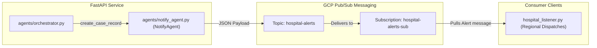

# GCP Pub/Sub Alerting Architecture

This document outlines the architecture, setup instructions, IAM access policy bindings, and deployment configurations for the real-time Google Cloud Pub/Sub integration in the CrisisRoute AI alerting system.

---

## 1. Alerting Workflow Diagram

The alerting pipeline triggers instantly upon bed reservation confirmation. It operates fully asynchronously from the database persistence flow.



---

## 2. IAM Permissions Required

To authorize the CrisisRoute service account deployed on Google Cloud Run to publish messages securely to Google Cloud Pub/Sub, the following configuration must be applied:

1. **Role required**: Pub/Sub Publisher (`roles/pubsub.publisher`).
2. **Resource**: `projects/{PROJECT_ID}/topics/hospital-alerts`

### Terraform / IAM Policy Bindings

Apply using `gcloud` CLI tools:

```bash
# Create the topic if it does not exist
gcloud pubsub topics create hospital-alerts

# Bind the Cloud Run execution service account as a Publisher
gcloud pubsub topics add-iam-policy-binding hospital-alerts \
    --member="serviceAccount:YOUR-CLOUD-RUN-SERVICE-ACCOUNT@crisisroute-2026-498212.iam.gserviceaccount.com" \
    --role="roles/pubsub.publisher"
```

---

## 3. Cloud Run Deployment Updates

The `deploy.sh` script should specify the target Pub/Sub topic and ensure credentials orApplication Default Credentials (ADC) are configured. Under Cloud Run, GCP automatically maps container default credentials to the service account executing the container, so no explicit credentials key file is needed.

Ensure the target project ID is specified in the deployment variables:

```bash
# Verify project ID settings in deploy.sh:
gcloud config set project crisisroute-2026-498212
```

---

## 4. Local Emulator Testing

For local development and testing, you can use the Google Cloud Pub/Sub Emulator.

### Setup Instructions

1. **Start the Pub/Sub emulator**:
   ```bash
   gcloud beta emulators pubsub start --host-port=127.0.0.1:8085
   ```

2. **Configure environment variables**:
   Tell CrisisRoute and the listener scripts to connect to the emulator by exporting `PUBSUB_EMULATOR_HOST`:
   ```bash
   export PUBSUB_EMULATOR_HOST=127.0.0.1:8085
   export GOOGLE_CLOUD_PROJECT=crisisroute-2026-498212
   ```

3. **Start the subscriber listener**:
   The listener will automatically detect the emulator and create the `hospital-alerts` topic and `hospital-alerts-sub` subscription if they are missing.
   ```bash
   python hospital_listener.py
   ```

4. **Trigger a triage request**:
   Run a pipeline query. The system will publish the payload to the emulator, and you will see the structured emergency card logged instantly inside the listener terminal session.
